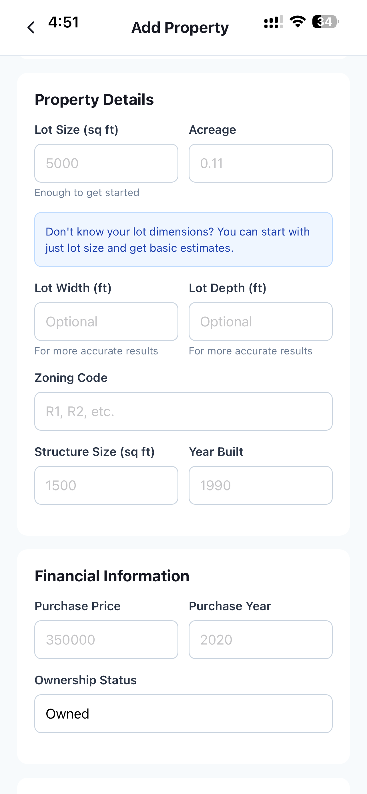
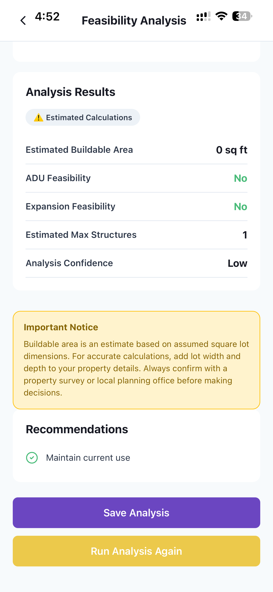

# 🏡 EazyAcres – Land & Development Deal Analyzer

> ⚡ Actively building in public — rapid iteration, real-world feedback, and continuous improvements

“Analyze land. Validate deals. Build smarter.”

---

## 📌 Overview

EazyAcres is a deal analysis tool designed to evaluate land development opportunities and determine what can realistically be built on a property.

It helps users:

- Analyze lot feasibility
- Understand zoning constraints
- Estimate build potential
- Make smarter real estate decisions

---
## 🔄 Recent Updates / Dev Log
### 📅 Latest Update — April 9, 2026 – Real Data + UX Flow Improvements

Today marked a major step forward in transforming EazyAcres from a concept tool into a real-world decision platform.

⸻

#### 🧠 Smart Property Intelligence (Live Data Integration)
	•	Integrated Google Places API (via secure proxy) for address autocomplete and structured location data
	•	Connected Regrid API for parcel-level enrichment (lot size, zoning, property details)
	•	Implemented server-side API protection using Supabase Edge Functions
	•	API keys are never exposed to the client
	•	Real-time enrichment flow:
		1.	User types address → autocomplete suggestions
		2.	Selection returns structured address + coordinates
		3.	Backend fetches parcel/property data
		4.	Fields auto-populate with verified vs estimated tagging

✅ Result: Users now get real property data instead of assumptions

⸻

#### 🧾 Data Transparency System
	•	Added data source labeling:
	•	Verified (real data)
	•	Auto-filled
	•	Estimated
	•	Introduced user-facing messaging:
	•	“We found property details for this address”
	•	“Some values are estimated…”
	•	Added:
	•	Refresh Data
	•	Improve Accuracy

✅ Result: Builds trust + clarity instead of hiding uncertainty

⸻

#### 🧮 Feasibility + AI Planning Improvements
	•	Enhanced feasibility engine:
	•	Buildable area calculations
	•	Structure sizing ranges
	•	Confidence scoring
	•	AI now generates:
	•	Development strategies (ADU, addition, renovation, etc.)
	•	Cost ranges, ROI, timelines
	•	Introduced scenario modeling:
	•	Budget / Standard / Premium options
	•	ROI + payback comparison

✅ Result: Moves from “idea” → “decision-making tool”

⸻

#### 🏗️ Smart Layout Generator (Visual Planning)
	•	Built a visual lot layout system:
	•	Street, neighbors, rear clearly defined
	•	Existing vs proposed structures
	•	Strategy-based placement (ADU, garage, etc.)
	•	Added contextual explanations for each layout

⚠️ Known UX improvement:
	•	Interior-only strategies (like renovations) need a different visualization approach

⸻

#### 🧭 UX Fixes + Flow Improvements
	•	Fixed:
	•	Safe area / header issues (tap targets, logout accessibility)
	•	Duplicate edit buttons
	•	Data persistence across sessions
	•	Improved:
	•	Property deletion with cascade cleanup
	•	Cache invalidation + real-time UI updates

⸻

#### ⚠️ Key UX Insight (Current Focus)

The biggest gap identified:

After selecting a strategy… users don’t know what to do next.

Planned solution:
	•	Introduce “Reality Check + Next Steps” layer
	•	Guide users through:
	•	Feasibility validation
	•	Permits & zoning checks
	•	Contractor steps
	•	Real-world execution

🎯 Goal: Transition from analysis → action

⸻

#### 🛠️ Technical Highlights
	•	React Native (Expo) + TypeScript
	•	Supabase (Auth, DB, Edge Functions)
	•	React Query for state + caching
	•	Secure API architecture (no client-side keys)
	•	Modular hook-based data system

⸻

#### 📍 Current Status

✅ Core system functional
✅ Real data integration working
✅ AI planning + scenarios live
🚧 UX refinement + execution guidance in progress

⸻

#### 💡 Vision

EazyAcres is evolving into:

A deal analysis + execution platform that helps users go from:

🏡 “I have land”  
➡️  
📈 “Here’s exactly how to turn it into value — and what to do next.”

⸻

#### 🚧 In Progress

- Reality Check + Next Steps (permits, zoning, execution guidance)
- Interior renovation visualization improvements
- Expanded real-data coverage (ATTOM integration)

### 🚀 Latest Update — April 8, 2026 (Phase 1 → Phase 2 Transition)

Major stability and UX improvements completed:

#### 🔧 Core Fixes
- Fixed React navigation bug (setState during render)
- Implemented proper auth flow with loading states
- Verified full data persistence across sessions
- Added Edit + Delete property flows
- Fixed mobile safe area / header tap issues

#### 🧠 Beginner-Friendly Mode
- Users can start with just an address
- Auto-estimates lot size, zoning, and dimensions
- Clearly labels estimated vs manual data

#### 📊 Feasibility Improvements
- No more 0 sqft results
- Buildable area now shown as ranges
- Added realistic structure size guidance

#### 🧬 Property Intelligence Layer
- Location-aware property estimates
- Field-level data source tracking (Estimated / Manual / Future fetched)
- “What Can I Build Here?” upgraded with real guidance tiers

#### 🎯 Result
EazyAcres is now a functional MVP that guides users from:
**address → analysis → strategy → planning**

#### 🔜 Next
- Smart Layout Generator (visual planning)
- Permit guidance system
- Build plan reports

## 🎯 Why I Built It

Real estate investing — especially land — is often unclear and risky due to:

- Unknown zoning restrictions
- Confusing lot dimensions
- Lack of quick feasibility insights
- Time-consuming manual calculations

EazyAcres was built to simplify this process into a clear, guided system that turns raw property data into actionable insights.

---

## 🚀 Features

- 📐 Lot size and dimension analysis
- 🏗️ Buildable area calculations (setbacks, zoning rules)
- 🧠 “What Can I Build Here?” intelligent recommendations
- 📊 Feasibility summaries for quick decision-making
- ⚡ Beginner-friendly mode with auto-filled estimates

---

## 🧠 Key Concept

EazyAcres focuses on decision clarity:

- Every property becomes a structured analysis
- Every constraint becomes a visible factor
- Every deal becomes easier to evaluate

---

## 📸 App Preview

### 🏡 Property Input & Analysis

### 📊 Feasibility Results

### 🧠 Build Recommendation Engine

---

## 🧰 Tech Stack

- React Native (Expo)
- TypeScript
- Supabase
- Custom property analysis logic
- External property & zoning data (planned integrations)

---

## 📈 What I Learned

- Translating real estate concepts into software logic
- Building decision-support tools instead of simple apps
- Designing systems for both beginners and experienced users
- Turning complex data into simple, actionable outputs

---

## 🔄 Status

Actively evolving — improving accuracy of calculations, expanding zoning logic, and enhancing AI-driven recommendations.

---

## 👤 Author

Babatunde Jegede
